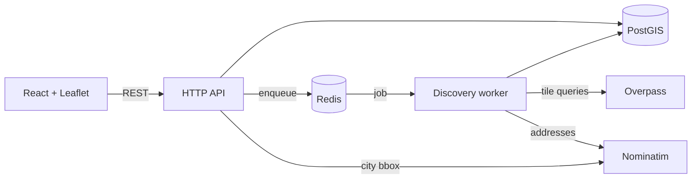

# MarketScope

See where your stores sit relative to the wider retail universe in a city.
Upload your portfolio, draw a boundary on a map, and MarketScope finds every
competing store inside it using OpenStreetMap data, then shows you all three
layers together — what's out there, which of yours are inside your boundary,
and which fell outside it.

---

## Running it

You need Docker and Node 22 or newer. From a clean clone:

```bash
cp .env.example .env
docker compose up -d                       # Postgres + PostGIS, Redis
npm install                                # root, api and app together
npm run init:setup --workspace api         # migrations, then seed reference data
```

Then start the three processes, each in its own terminal:

```bash
npm run dev    --workspace api    # http://localhost:3000
npm run worker --workspace api    # discovery worker
npm run dev    --workspace app    # http://localhost:5173
```

**The worker is not optional.** Creating a market enqueues a job; without a
worker consuming it, markets sit at `queued` forever. The status screen tells
you so rather than spinning, but it's the first thing to check if discovery
never starts.

`init:setup` deliberately doesn't start Docker. Container lifecycle and schema
setup are separate concerns, and keeping them apart means either can be re-run
without the other. Both are idempotent.

If you'd rather run Postgres yourself than through Docker, create the database
first — `createdb market_scope` — since a migration runs _inside_ a database
and can't create the one it's running in.

### Trying it out

`sample-data/` has four portfolios you can upload straight away. Each is built
around a real Bengaluru neighbourhood with a documented inside/outside split:

| File                             | Stores | Try it with                                              |
| -------------------------------- | ------ | -------------------------------------------------------- |
| `new-bel-road-grocery.csv`       | 20     | Supermarket + Department Store, boundary on New BEL Road |
| `new-bel-road-clothing.csv`      | 20     | Clothing Store, same boundary                            |
| `malleshwaram-sweets-bakery.csv` | 112    | Bakery, boundary centred on 13.003, 77.570               |
| `sadashivanagar-electronics.csv` | 86     | Electronics Store, centred on 13.008, 77.580             |

The store names and coordinates are invented — placed on real localities so
the geography reads correctly, but no such chains exist. The stores you
_discover_ are real OSM data.

---

## Tests

One-time, to create the throwaway database the integration suite runs against:

```bash
npm run test:setup --workspace api
```

Then, from the root:

```bash
npm test                                    # everything: api + frontend
```

Or individually:

```bash
npm run test:unit        --workspace api    # 79, no database needed
npm run test:integration --workspace api    # 103, needs PostGIS + Redis
npm test                 --workspace app    # 77, jsdom
```

The integration suite `DELETE`s from `portfolio_store`, `market` and the
caches, so it **refuses to run** unless `TEST_DATABASE_URL` points somewhere
disposable. It destroyed a working development database once before that guard
existed. `test:setup` creates, migrates and seeds that database; `.env.example`
already has the URL.

Overpass and Nominatim are stubbed with local HTTP servers, so no test ever
touches a rate-limited public service.

`npm run ci` runs what CI runs: format check, lint, typecheck, build. CI also
runs both test suites plus CodeQL on every PR to `main`.

---

## How it works

Two Node processes sharing Postgres and Redis. The API answers requests; a
separate worker does the slow work of fetching from OpenStreetMap.



Creating a market returns `202` immediately with an id. The worker splits the
boundary into 1.5 km tiles, fetches each tile-and-category pair it doesn't
already have cached, geocodes any portfolio rows that arrived without
coordinates, and classifies everything against the boundary. The frontend
polls a status endpoint until it's done.

A real run over central Bengaluru: 72 tile-fetches across two categories, 112
stores found inside a 28.7 sq km boundary, taking a couple of minutes.

**[Full architecture →](docs/architecture.md)** ·
**[Technical spec →](docs/tech-spec.md)** ·
**[Sequence diagrams →](docs/sequence-diagrams.md)** ·
**[Flowcharts →](docs/flowcharts.md)**

---

## The decisions worth defending

Each of these has a full write-up in [`docs/decisions/`](docs/decisions/) with
the alternatives that were rejected and what the choice costs. The short
versions:

**OpenStreetMap rather than Google Places** ([ADR-0001](docs/decisions/0001-openstreetmap-over-commercial-apis.md)).
No billing account means a reviewer can actually run this. It also means OSM's
licence permits caching results in our own database, which the entire tile
cache depends on. The cost is coverage — OSM tagging is uneven, and
`shop=department_store` is barely used in India.

**Tiles keyed to the world, not to the market** ([ADR-0003](docs/decisions/0003-tile-based-caching.md)).
Every boundary is split onto a fixed global grid, so two overlapping markets
land on the same tile keys and the second one reuses what the first fetched.
`discovered_store` hangs off `tile_fetch` rather than off `market` — which is
what makes sharing possible, and also why deleting a stale tile would silently
empty an existing market's dashboard.

**Discovery on a queue, in its own process** ([ADR-0004](docs/decisions/0004-async-discovery-queue.md)).
A market at the 30 sq km cap covers 20 tiles — 60 Overpass requests across
three categories, at one every four seconds. That is four minutes. Doing it
inside a request handler means a connection held open that long and then lost
to a proxy timeout with nothing to show for it.

**Two cache lifetimes** ([ADR-0005](docs/decisions/0005-two-cache-lifetimes.md)).
Geocodes never expire, because an address doesn't stop being at its
coordinates. Tiles go stale after five days, because shops close. Staleness is
checked when a tile is read rather than by a sweeper, which keeps correctness
in one place.

**`geography` for points, `geometry` for boundaries** ([ADR-0002](docs/decisions/0002-geography-vs-geometry.md)).
Geography gives metres without projecting, which is what distance queries
need. Geometry gives a fast indexed `ST_Contains`, which is what containment
needs. Area is measured by casting to geography at the call site, because
`ST_Area` on a geometry column returns square degrees.

**Token-bucket rate limiting, tuned by measurement** ([ADR-0006](docs/decisions/0006-token-bucket-rate-limiting.md), [ADR-0007](docs/decisions/0007-overpass-pacing.md)).
Nominatim runs at 0.9 requests/second rather than 1.0 — running exactly at a
documented ceiling leaves no room for timing jitter, and two requests inside
one wall-clock second is enough to get cut off. Overpass runs at 0.25/second
after a sample of tile queries came back with 50% first-attempt failures.
That investigation also found the code was ignoring `Retry-After` entirely,
which turns one rate-limit response into a run of them.

**Matching your stores against OSM's** ([ADR-0010](docs/decisions/0010-store-matching.md)).
A fourth layer marks portfolio stores that already have an OpenStreetMap store
within 150 metres. `ST_DWithin` takes metres only because both columns are
`geography`; on `geometry` that argument would be degrees. It is computed on
read rather than stored, because a match depends on discovered stores that
change whenever a tile is re-fetched.

**No state library on the frontend** ([ADR-0009](docs/decisions/0009-frontend-state.md)).
Six screens, nothing genuinely shared between them. One `useRequest` hook
covers loading, errors and cancelling superseded responses in about sixty
lines. At twenty screens this would be the wrong call.

---

## Known limitations

**OSM coverage is the honest headline.** Tagging quality varies by
neighbourhood and small independents are often missing entirely. A market for
department stores in Bengaluru returns almost nothing, because that tag is
barely used there — 38 supermarkets against 2 department stores in one real
query over the same area. Nothing in this system can fix that.

**The public Overpass instance is unreliable and slow by design.** A sampled
50% of tile queries failed on first attempt during testing, split between 429
and 504. Retries with jitter and `Retry-After` handling bring the final
success rate up, but a market takes minutes rather than seconds and a busy day
upstream will show as `tilesFailed` on the status screen. Partial failures
surface in `market.error` and the map is still useful — the dashboard says so
rather than pretending.

**No cleanup job for stale tiles**, and this is a correctness decision rather
than an unfinished one. Because `discovered_store` cascades from `tile_fetch`,
deleting a stale tile would empty the dashboard of any existing market that
overlapped it. Doing it safely needs a `market_tile` join table so a tile can
be retained while any market still depends on it.

**The rate limiter is per process.** Running two workers means two token
buckets and twice the real request rate, which breaches fair use without
anything in the code looking wrong. Scaling out needs a Redis-backed bucket.

**A market's portfolio split reflects the current portfolio**, not the one
that existed when the market was created. Re-uploading reclassifies every
existing market. That's the more useful reading for this product, but it is a
semantic choice — see [ADR-0008](docs/decisions/0008-reclassify-markets-on-upload.md).

**Uploads are held in memory.** Capped at 5 MB and parsed in one pass. Fine
for the sizes involved; a production version would stream to disk.

**Reference data is India only**, seeded from a static package. Adding another
country is a seed change, but the data has the granularity that package has —
242 cities for Karnataka, only 4 for Puducherry.

**Store matching is proximity, not identity.** Two supermarkets 100 m apart
match each other regardless of brand. It also looks poor against the sample
portfolios, since those are invented stores that mostly have no real OSM
neighbour — the layer is honest but nearly empty for them.

**A boundary corner dragged past the map's edge can't be grabbed again.** It's
clipped by the container's overflow. Recoverable by panning or zooming out,
and the numeric edge inputs below the map are a way around it entirely.

---

## What production would need

Deliberately out of scope, listed so the boundary is explicit rather than
accidental.

**Observability.** There is `console.error` and nothing else. A real
deployment wants structured logging with a correlation id per job, and metrics
for the things that actually predict failure here: tile cache hit rate,
Overpass 429/504 counts, queue depth, and the age of the oldest `processing`
market. Alerting on that last one would catch a dead worker, which is
currently only visible by noticing a market never finishes.

**Idempotency beyond the enqueue.** `jobId = market-<id>` stops duplicate
jobs, and `saveTileStores` replaces a tile's contents transactionally. But a
job that dies mid-run leaves partial state that the retry re-does rather than
resumes. Making tiles individually resumable would need per-tile progress
rather than counters.

**A dead-letter queue.** After three attempts a job is marked failed and
forgotten. There's no way to inspect or replay it, and no UI for a market
that's been half-built for an hour.

**Connection pooling and DB hardening.** A single `pg.Pool` with default
settings, no statement timeouts, no read replicas. Migrations are versioned
and ordered, which is the part that matters most, but nothing enforces that a
long-running query can't pin a connection.

**Auth and multi-tenancy.** There is no concept of a user. The portfolio is
global — one upload replaces everyone's. `geocode_cache` being shared across
tenants would need thought under real tenancy, if only because "which
addresses has anyone looked up" is itself information.

**Streaming CSV parsing.** See above; the 5 MB cap is what currently stands in
for it.

**Push instead of polling.** The status screen polls every 10 seconds because
that's simple and survives a page reload. Server-sent events would be the
natural upgrade — the worker already writes progress at a fixed interval, so
the producer side barely changes.

**A shared rate-limit budget.** The single biggest blocker to running more than
one worker. A Redis-backed token bucket, so the limit belongs to the
application rather than to each process.

**Self-hosted Overpass and Nominatim.** The real answer to both the rate limit
and the reliability problem, and the point at which this stops being a
take-home and starts being infrastructure.

---

## Repository layout

```
api/            Express API + discovery worker
  migrations/   eight numbered SQL migrations
  src/
    routes/       HTTP surface — validation, status codes, no SQL
    controllers/  the actual work
    repositories/ every SQL statement in the system
    helpers/      pure functions: tiling, rate limiting, CSV coercion
  test/         77 unit, 94 integration (Mocha + Chai)
app/            Vite + React frontend
  src/
    pages/        one component per route
    components/   map, error boundary, boundary editor
    lib/          pure functions: area, labels, throttling
  test/         65 tests (Vitest + React Testing Library)
docs/           architecture, tech spec, diagrams, decision records
cycles/         the five build cycles, with exit criteria and findings
sample-data/    four portfolios you can upload
```

The routes/controllers/repositories split is the one piece of structure worth
defending: a route handler reads as a description of its contract, and every
query in the system can be found by grepping one directory.
