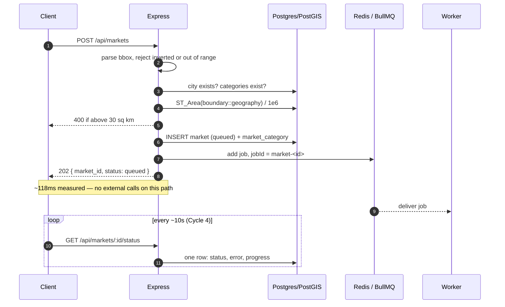
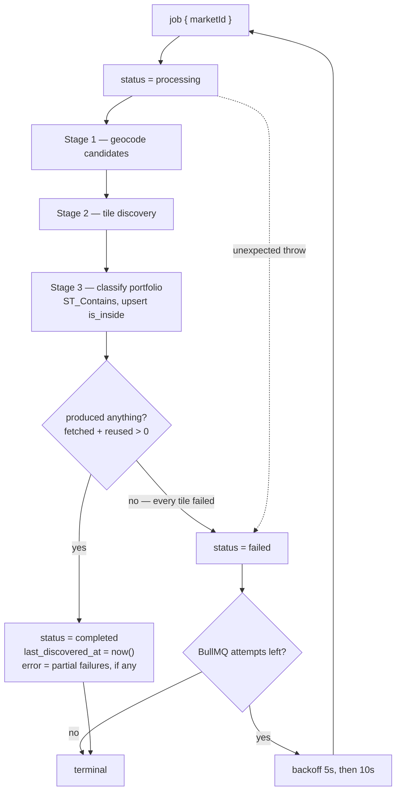
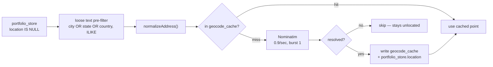
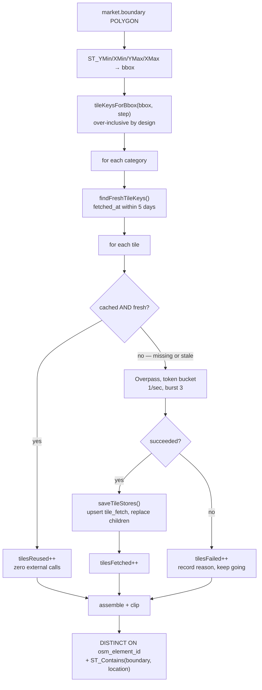
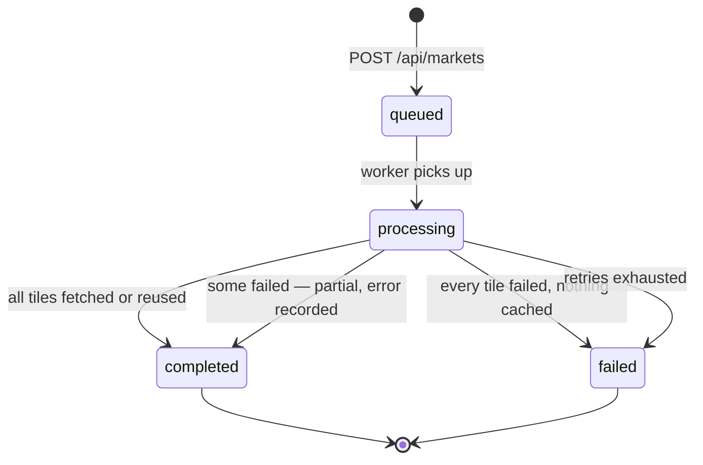

# Cycle 3 — Market creation & discovery engine (step 3, the hard part)

**Goal:** the async discovery pipeline works end-to-end against real
Overpass/Nominatim, respecting the tiling/caching/freshness design in §3.
This is the highest-risk cycle and the one most explicitly named in
what's being evaluated (§1: "real third-party API handling").

**Depends on:** Cycle 1 (schema), Cycle 2 (portfolio rows + market-setup
data exist).
**Blocks:** Cycle 4 (dashboard has nothing to read until this produces data).

---

## Code flow

### Files

```
POST /api/markets
  routes/market.ts          validate body, area cap, enqueue
  repositories/market.ts    createMarket, boundaryAreaSqKm
  queue.ts                  enqueueDiscovery (jobId = market-<id>)

worker
  worker.ts                 BullMQ Worker, retry exhaustion -> failed
  controllers/discovery.ts  the three stages, status transitions
  controllers/geocode.ts    Nominatim + geocode_cache      (token bucket)
  controllers/overpass.ts   Overpass + retryable/permanent (token bucket)
  helpers/tiling.ts         bbox <-> tile keys
  helpers/overpass.ts       build Overpass QL, parse elements
  helpers/rateLimiter.ts    token bucket
  repositories/discovery.ts freshness, upsert, clip, classify
```

### 1. Request path — returns before any fetching happens



The job id is the market id, so a duplicate enqueue is ignored rather than
running discovery twice.

### 2. Worker pipeline — three stages, always terminal



`processing` is never a resting state: every exit path writes `completed` or
`failed`, otherwise the frontend would poll forever.

### 3. Stage 1 — geocoding, cheapest source first



The pre-filter only bounds API cost; it can add candidates but never remove a
genuine match. `geocode_cache` needs no freshness check — an address's
coordinates do not change.

### 4. Stage 2 — the tile loop



Stale is treated exactly like missing, which is why correctness never depends
on a cleanup job (§3.6).

### 5. Why tiles are not attached to markets

```
market ──< market_category >── category
   │                              │
   │ (no FK — deliberate)         │
   ▼                              ▼
boundary ····· overlaps ····· tile_fetch (tile_key, category_id, fetched_at)
                                   │
                                   ▼ ON DELETE CASCADE
                             discovered_store (osm_element_id, location)
```

`discovered_store` hangs off `tile_fetch`, never off `market`. That decoupling
is what lets two overlapping markets share one fetch — and is also why a
cleanup job would silently empty an existing market's dashboard.

### 6. Status transitions



### 7. Measured behaviour

| Run                             | Tiles                    | Overpass calls |
| ------------------------------- | ------------------------ | -------------- |
| First market                    | 9 total, 9 fetched       | 9              |
| Overlapping market (shifted)    | 12 total, 9 reused       | 3              |
| Identical market                | all reused               | 0              |

---

## 3.1 Create-market endpoint

- `POST /markets`: validate boundary is within the 30 sq km cap
  (server-side check too, not just frontend — never trust the client),
  insert a `market` row with `status='queued'`, insert `market_category`
  rows for the selected categories, enqueue a BullMQ discovery job keyed
  by the new market id, return `200` + `{ market_id }` **immediately**.
- Do not do any geocoding or discovery synchronously in this handler —
  that's the entire point of queuing (§3.6).

## 3.2 Worker — portfolio geocoding

- **Candidate pre-filter, not a correctness filter.** You can't know if an
  ungeocoded row is inside the boundary without geocoding it first, but
  geocoding *every* row in the customer's entire uploaded portfolio just
  to create one small-city market wastes rate-limited Nominatim calls on
  stores with nothing to do with it. So: pre-filter portfolio rows with
  NULL `location` down to plausible candidates before geocoding — but
  this filter's only job is bounding API cost, it must never be the thing
  that decides in/out.
  - Match **case-insensitive, partial** against the row's `city` **OR**
    `state` **OR** `country` text vs. the market's city/state/country —
    an OR of loose matches, not an exact AND. A store whose `city` field
    says "Bangalore" instead of "Bengaluru", has a typo, or is blank must
    still be considered a candidate, not silently skipped. Exact-match
    filtering here is a real correctness bug: it would drop a store that
    is genuinely inside the boundary just because its free-text city
    field didn't match ours character-for-character (§4's `city` text
    columns on `portfolio_store` are unstructured user input, never
    normalized against the `city` reference table — see the discussion
    in this cycle's design notes).
  - `ST_Contains(boundary, location)` after geocoding is the **only**
    authoritative answer for inside/outside. The pre-filter can only ever
    add extra candidates to geocode, never remove a genuine match.
  - **Known limitation to document in the README (§7 pattern)**: this
    pre-filter is still an approximation — a blank or wildly wrong
    city/state/country field can still cause a genuinely-inside store to
    be skipped. The fully-correct alternative is geocoding every
    ungeocoded portfolio row unconditionally on first use and letting
    `ST_Contains` decide with no pre-filter at all — more expensive on a
    customer's *first* market (geocodes their whole portfolio once), but
    `geocode_cache` means every market created after that pays nothing
    extra for the same stores. Worth naming as a deliberate tradeoff, not
    leaving implicit.
- Check `geocode_cache` first (`normalized_address` → `location`) before
  calling Nominatim — this table is immutable and kept forever (§3.1), so
  a hit here is a pure win with no freshness check needed.
- On a miss: call Nominatim, write the result to both `geocode_cache` and
  back onto `portfolio_store.location`.
- After geocoding, classify inside/outside via `ST_Contains(boundary,
  location)` and upsert into `portfolio_store_market` with the resulting
  `is_inside`.

## 3.3 Worker — tile-based discovery

Follow §3.3/§3.4 exactly — this is the single most important piece of
logic in the project:

1. Decompose the market's boundary into the fixed grid tiles (geohash/H3
   cell) it overlaps.
2. For each overlapping tile × each selected category:
   - Check `tile_fetch` for an existing row (`tile_key`, `category_id`).
   - **Cached AND fresh** (`fetched_at` within the freshness window, ~5
     days) → reuse, skip the external call.
   - **Missing or stale** → call Overpass for that tile's bbox (broad
     fetch is fine — Overpass returns many tags per call, trading API
     calls for compute per §3.4's note), upsert-overwrite the
     `tile_fetch` row with a fresh `fetched_at`, and replace its
     `discovered_store` children.
3. Assemble the full result set from all overlapping tiles' discovered
   stores, **dedupe by `osm_element_id`** (a store can appear in more than
   one tile near a boundary), then **clip to the exact market boundary**
   with `ST_Contains`/`ST_Covers` (tiles are coarser than the drawn
   rectangle, so this final clip is required for correctness).
4. Persist the clipped, deduped set — but remember `discovered_store` is
   keyed to `tile_fetch`, not directly to `market` (§4), so "persisting for
   this market" really means the market's dashboard queries assemble from
   tiles at read time; nothing extra needs to be written per-market here
   beyond the tile/store rows themselves.

## 3.4 Robustness (this is what's being evaluated)

- **Rate limiting**: respect Nominatim/Overpass public fair-use limits —
  pace worker calls (e.g. a simple token bucket or fixed delay between
  external calls), don't fire them concurrently without a cap.
- **Retries**: transient failures (timeout, 5xx, rate-limit response) get
  retried with backoff; BullMQ's built-in retry/backoff options cover this.
- **Partial failure**: if some tiles/categories succeed and others
  permanently fail after retries, don't fail the whole market — persist
  what succeeded, and record which parts failed (e.g. on the job/market
  `error` field) so the dashboard can show a coherent partial result
  rather than nothing.
- **Status transitions**: `queued → processing → completed`, with
  `failed` as a first-class terminal state (not just "processing forever").
  `market.status` is the durable, queryable projection the status API
  reads — BullMQ owns transient execution state in Redis, Postgres is the
  source of truth the frontend polls (§5 note on this exact split).

## 3.5 Status endpoint

- `GET /markets/:id/status` → `{ status, progress? }` where `progress` can
  be as coarse as "tiles fetched / tiles total" — good enough for the
  frontend's 10s poll loop in Cycle 4.
- On successful completion, set `market.last_discovered_at = now()`
  (migration `007`) — Cycle 4 reads it for the "Discovered `<date>`" label.

## 3.6 Cache cleanup — deliberately not built

The §3.5 BullMQ repeatable cleanup job stays unbuilt, and the README should
say why rather than list it as unfinished:

- `discovered_store` hangs off `tile_fetch`, with nothing linking a market to
  its tiles (that decoupling is exactly what makes tiles reusable, §3.3). So
  deleting a stale `tile_fetch` cascades its stores away and **silently empties
  an existing market's dashboard** — the dashboard reads straight from Postgres
  and never re-runs discovery (§3.6 of the knowledge doc).
- Deleting safely would mean decoding every `tile_key` back into a polygon and
  spatially testing it against every live market boundary. Real work, no
  user-visible benefit at take-home scale.
- Read-time freshness already guarantees *correctness* for the discovery path;
  cleanup was only ever about reclaiming space.

---

## Exit criteria

- [x] `POST /markets` for a real small city boundary returns `200` +
      `queued` in well under a second (no synchronous work in the handler).
- [x] Polling `/markets/:id/status` reaches `completed` within a reasonable
      time for a small boundary + 1-2 categories.
- [x] `discovered_store` rows for the market are correctly clipped — spot
      check a store near the boundary edge that should be excluded is
      actually excluded.
- [x] Portfolio rows inside the boundary are marked `is_inside=true` in
      `portfolio_store_market`; rows outside are `false`.
- [x] Creating a **second market with an overlapping boundary** (same
      city, overlapping rectangle) reuses already-cached tiles — verify
      via logs or a temporary counter that fewer external Overpass calls
      happen on the second run than the first.
- [x] Force a category/tile fetch to fail (e.g. temporarily point at a bad
      URL) and confirm the market still reaches a sane terminal state
      (`failed` or a documented partial-success behavior) instead of
      hanging in `processing`.
