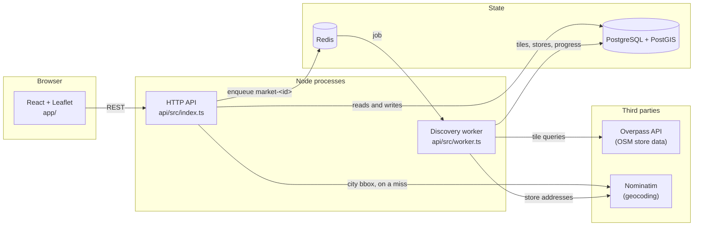
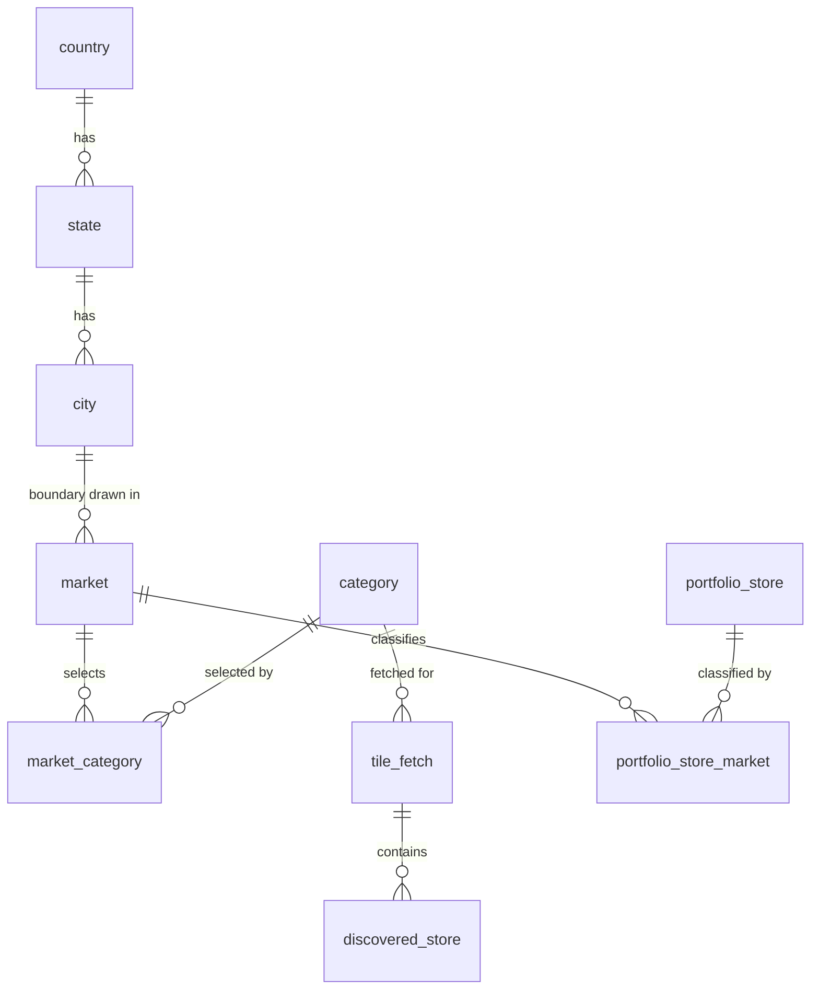
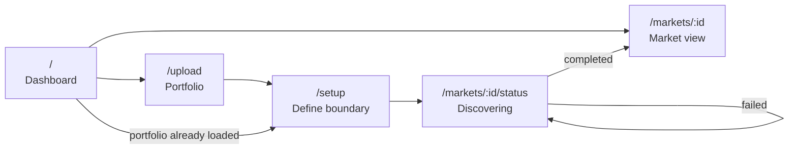

# Architecture

MarketScope answers one question: for a city boundary you draw yourself, which
retail stores are inside it, and how do your own stores sit against them.

Everything below follows from two facts about the data source. OpenStreetMap
is free but rate limited, and it does not know about your portfolio. So the
system spends most of its effort on two things — fetching OSM data slowly and
carefully enough not to get cut off, and reusing whatever it has already
fetched.

## The pieces

Two Node processes, not one. The API answers requests; the worker does the
slow work. They share Postgres and Redis and nothing else. You can run the API
without the worker and every screen still loads — markets simply never leave
`queued`, which the status page reports honestly rather than spinning forever.

Both talk to Nominatim, for different reasons. The API needs a city's bounding
box to seed the map rectangle, which has to happen while the user waits. The
worker needs coordinates for portfolio rows that arrived without any, which
does not.

## What lives where

| Path                    | Responsibility                                                                         |
| ----------------------- | -------------------------------------------------------------------------------------- |
| `api/src/routes/`       | HTTP surface. Parsing, validation, status codes. No SQL.                               |
| `api/src/controllers/`  | The actual work — CSV parsing, discovery orchestration, Overpass and Nominatim calls.  |
| `api/src/repositories/` | Every SQL statement in the system.                                                     |
| `api/src/helpers/`      | Pure functions: tiling maths, the token bucket, CSV coercion, Overpass query building. |
| `api/migrations/`       | Eight numbered SQL migrations. Schema is never touched outside these.                  |
| `app/src/pages/`        | One component per route.                                                               |
| `app/src/lib/`          | Pure functions the UI leans on — area, boundary normalisation, label formatting.       |
| `app/src/api/`          | The only place `fetch` is called.                                                      |

The split between routes, controllers and repositories is the one piece of
structure worth defending. It means a route handler reads like a description
of the endpoint's contract, and every query in the system can be found by
grepping one directory. When the portfolio re-upload bug turned up (see
[ADR-0008](decisions/0008-reclassify-markets-on-upload.md)), the fix was one
new function in `repositories/discovery.ts` and one line in a controller,
because nothing else knew how the classification was stored.

## Data model

Two things about this diagram are deliberate and worth spelling out.

**`discovered_store` hangs off `tile_fetch`, not off `market`.** A tile is a
1.5 km square of the world fetched for one category. Two markets that overlap
share the tiles they both cover, so the second one costs fewer Overpass calls
than the first. The price is that no row anywhere says "these stores belong to
market 7" — that relationship is computed at read time by a spatial query. See
[ADR-0003](decisions/0003-tile-based-caching.md).

**`portfolio_store_market` is derived data with a cascade on both sides.**
Deleting a market or a portfolio store should take the classification with it.
That is correct, and it also caused a real bug: uploading a new portfolio
wiped the inside/outside split of every existing market, silently, because the
market and its discovered stores both survived. The fix reclassifies on
upload. That story is [ADR-0008](decisions/0008-reclassify-markets-on-upload.md).

Points are stored as `geography(POINT, 4326)` and boundaries as
`geometry(POLYGON, 4326)`. The reasoning for the mixture is in
[ADR-0002](decisions/0002-geography-vs-geometry.md); the short version is that
geography gives you metres for free and geometry gives you a fast
`ST_Contains`.

## Request paths

There are exactly two shapes of request in this system, and keeping them
separate is most of the design.

**Fast reads go straight to Postgres.** Every dashboard endpoint is one query
against indexed columns. None of them touch Redis, Overpass or the worker.

**Slow work goes on the queue.** `POST /api/markets` writes a row, enqueues a
job and returns `202` with the market id. It never waits for discovery. A
market at the 30 sq km cap covers 20 tiles, so three categories is 60 Overpass
requests at one every four seconds — four minutes. A synchronous version would
hold an HTTP connection open that long and then time out somewhere in the
middle.

The full pipeline is drawn in [sequence-diagrams.md](sequence-diagrams.md).

## Rate limiting, and why it is the interesting part

Both upstreams are free public services with fair-use limits, and both will
stop answering if you lean on them. Nominatim's policy is one request per
second, absolute. Overpass grants two concurrent slots per IP and bills by CPU
time rather than request count, so "one request per second" understates how
heavy a run is.

Every outbound call goes through a token bucket
(`api/src/helpers/rateLimiter.ts`) — capacity for bursts, a refill rate for
sustained throughput, and a FIFO queue so nothing starves. Nominatim runs at
0.9/sec with a burst of 1, deliberately under the ceiling so a slow event loop
tick cannot put two requests inside the same second. Overpass runs at 0.25/sec
with a burst of 1.

Those Overpass numbers came from measurement, not from the documentation. A
sample of tile-sized queries against the public instance came back with 50%
first-attempt failures — a mix of 429 and 504 — which is what pushed the rate
down, moved retries onto exponential backoff with jitter, and made the code
honour `Retry-After` instead of guessing. [ADR-0007](decisions/0007-overpass-pacing.md)
has the numbers and the reasoning.

The limiter is per process. Two workers means two buckets and twice the real
rate, which would breach fair use without anything in the code looking wrong.
That constraint is called out in the source and in
[Known limitations](../README.md#known-limitations).

## Caching

Two caches with different lifetimes, because the underlying facts have
different lifetimes.

`geocode_cache` maps a normalised address to a point and never expires. An
address does not stop being at its coordinates. Rows are shared across every
market and every user, so a portfolio uploaded twice costs nothing the second
time.

`tile_fetch` carries a `fetched_at` and is considered stale after five days.
Shops open and close. Staleness is evaluated when the tile is read, not by a
background job, which keeps correctness in one place — there is no window
where a cleanup job has run but a reader has not noticed.

There is no cleanup job deleting stale tiles, and that is deliberate rather
than unfinished. Because `discovered_store` hangs off `tile_fetch`, deleting a
stale tile would empty the dashboard of any existing market that overlapped
it. Fixing that properly needs a market-to-tile link the schema does not have.
[ADR-0003](decisions/0003-tile-based-caching.md) covers the trade.

## Frontend

Four screens on React Router, with the market id in the URL so a dashboard
survives a reload and can be linked to.

State is local to each page. There is no store, no query library and no
context — the data each screen needs is fetched by that screen, and nothing is
shared across routes except the URL. At six screens that is less machinery for
the same result; at twenty it would not be.

The one piece of shared infrastructure is `useRequest`, which handles the
loading/error/data triple and discards responses that have been superseded.
That last part matters for the cascading dropdowns: pick state A, then quickly
state B, and A's slower response can otherwise land last and show A's cities
under B's name.

Area is computed with `@turf/area` over the real polygon rather than
width × height in degrees. At Bengaluru's latitude the naive product reads
29.24 sq km where turf reads 28.81 — about 1.5% — which is the difference
between a boundary the UI accepts and one the API rejects. The client also
reads slightly high against PostGIS's own `ST_Area`, so it gates fractionally
early. That is the safe direction.
