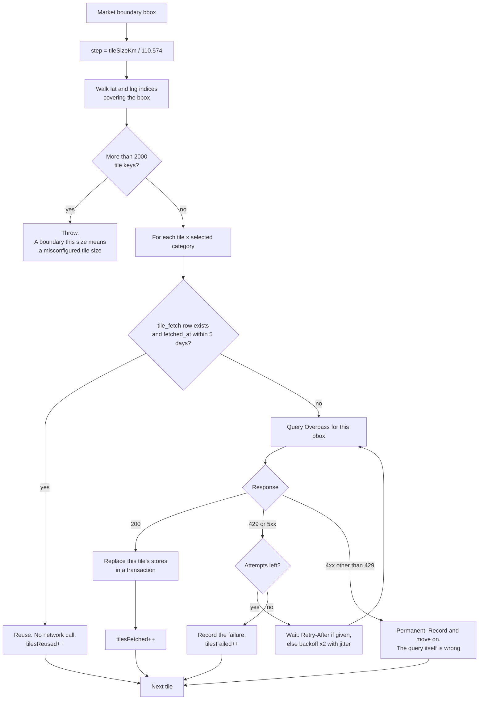
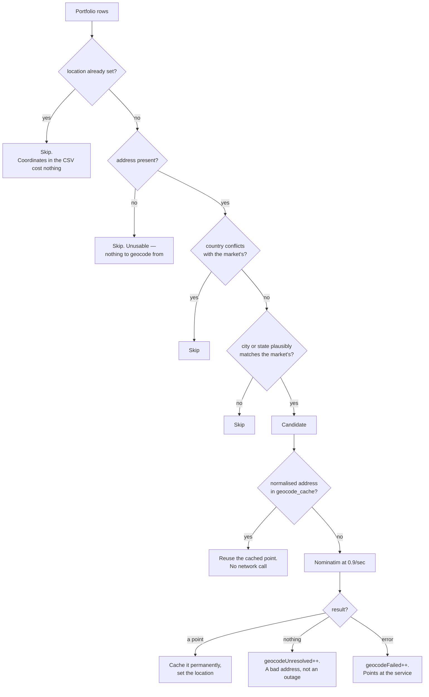
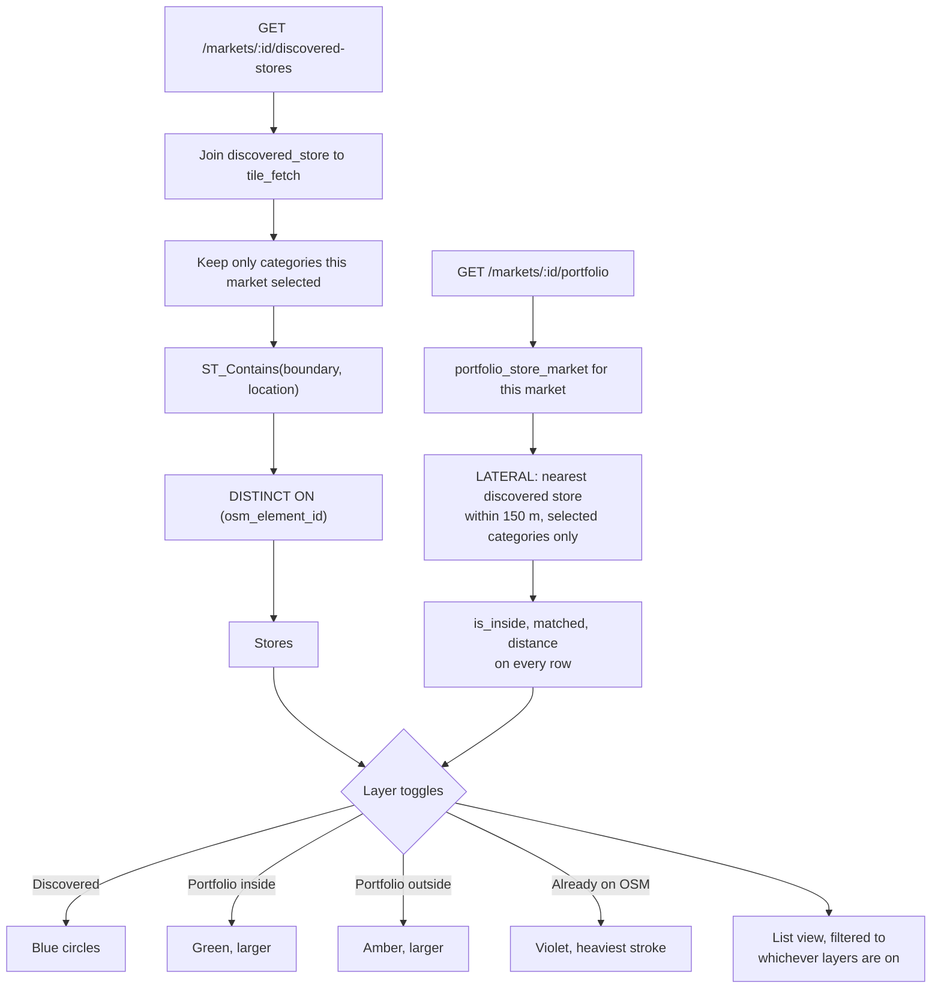
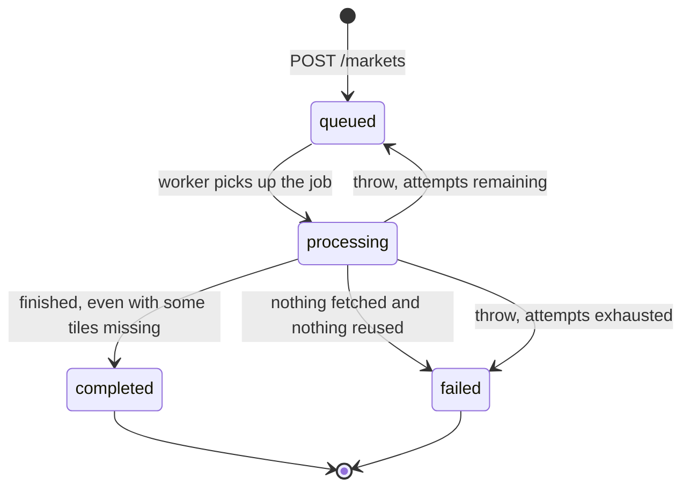

# Flowcharts

Decision logic that is hard to follow from the code alone, either because it
is spread across files or because the interesting part is the branch nobody
takes.

## Tiling a boundary

The grid is fixed to the world, not to the market. That is the whole point:
two markets that overlap land on the same tile keys, so the second one reuses
what the first fetched.

The step is computed from latitude only — 110.574 km per degree — even though
a degree of longitude shrinks as you move away from the equator. That makes
tiles narrower than 1.5 km in the east–west direction at any non-zero
latitude, so the grid over-covers. Over-covering is free; under-covering
silently loses stores.

Two things this diagram does not show, because they happen elsewhere. Tiles
are deliberately over-inclusive of the boundary, so the cache holds stores
outside the rectangle the user drew — the clipping is done by `ST_Contains` at
read time. And a `4xx` is not retried at all, because repeating a malformed
query fails identically three times and spends fair-use budget for nothing.

## Which portfolio rows get geocoded

The pre-filter here is the difference between a demo that works and one that
sits at one request per second for twenty minutes.

`Unresolved` and `Failed` are counted separately on purpose. One means the
address is wrong, the other means the geocoder is down, and a single number
would make an outage look like a portfolio full of typos.

The country check only ever excludes. An early version filtered on
`country ILIKE '%India%'`, which matches every row in an Indian portfolio and
therefore filtered nothing — a test passed vacuously for weeks because of it.
Rows with no city and no state at all are kept as candidates rather than
dropped, since a bare address is exactly what geocoding is for.

## What the dashboard shows

Three things are load-bearing in that left-hand column.

The category join is what stops a market for supermarkets showing pharmacies
that a neighbouring market happened to fetch into a shared tile.

`ST_Contains` alone is enough — there is no tile filter on this path, unlike
the worker's count. A store inside the boundary is necessarily inside a tile
that overlaps it, so the two are equivalent, and leaving the tiling out keeps
the read path free of any knowledge of how the cache is organised.

`DISTINCT ON` matters because tiles overlap at their edges and Overpass can
return the same element in two adjacent queries. Without it a store on a tile
boundary is counted twice.

The match on the right-hand side is a `LEFT JOIN LATERAL` so the radius filter
runs per portfolio store and stops at the closest hit. A matched store belongs
to two layers at once — it is still inside or outside the boundary — so it
renders once, styled as matched while that layer is on and falling back to its
inside/outside styling when it is off. It disappears only when both are off.

## Market status

The distinction between the two edges into `failed` is where the honesty
lives. A run that fetched some tiles and lost others reports `completed` with
a warning, because the map is genuinely useful and simply incomplete. A run
that fetched nothing at all reports `failed`, because an empty map and an
empty area look identical to a user and calling that success would be a lie.

The loop from `processing` back to `queued` is BullMQ retrying. It only works
because `runDiscovery` does not catch and write a terminal status on its way
out — an earlier version did, which quietly made the retry configuration dead
code.
