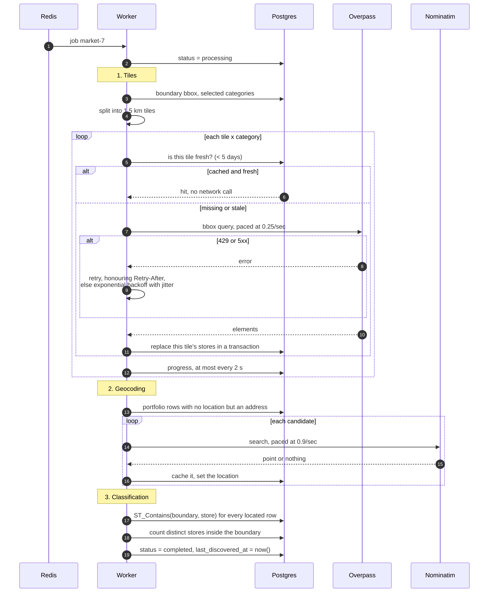

# Sequence diagrams

Four paths worth drawing. The rest of the system is CRUD.

## Uploading a portfolio

An upload replaces everything. There is no merge, no partial import, and no
"skip the bad rows" — a file is either wholly valid or wholly rejected.

```mermaid
sequenceDiagram
    autonumber
    actor U as User
    participant UI as Upload screen
    participant API as POST /api/portfolio/upload
    participant P as parsePortfolioCsv
    participant DB as Postgres

    U->>UI: choose file
    UI->>API: multipart, field "file"
    API->>API: multer: reject non-CSV (415) or >5 MB (413)
    API->>P: buffer

    P->>P: parse; headers; then rows
    alt any row invalid
        P-->>API: throw with every bad row
        API-->>UI: 422 + details.errors[]
        UI-->>U: table of line, column, problem
    else all rows valid
        P-->>API: rows
        API->>DB: BEGIN
        API->>DB: DELETE FROM portfolio_store
        API->>DB: INSERT the new rows
        API->>DB: reclassify every existing market
        API->>DB: COMMIT
        API-->>UI: 201 imported / with_coordinates / awaiting_geocoding
    end
```

Validation runs cheapest-first: can it be parsed at all, then are the headers
right, then are the rows right. A file with the wrong columns is reported as
such rather than as "no data rows", which is what you get if you check the row
count first.

Step 12 is the fix for a bug rather than an original design. `portfolio_store_market`
cascades from `portfolio_store`, so replacing the portfolio used to blank the
inside/outside layers of every market created before it — without any error,
because the market row and its discovered stores both survived.

## Creating a market

```mermaid
sequenceDiagram
    autonumber
    actor U as User
    participant UI as Setup screen
    participant API as POST /api/markets
    participant DB as Postgres
    participant R as Redis / BullMQ

    U->>UI: pick city and categories, size the rectangle
    UI->>UI: turf.area on every drag (throttled 120 ms)
    Note over UI: Create stays disabled above 30 sq km,<br/>and says why
    U->>UI: Create market

    UI->>API: cityId, categoryIds, boundary
    API->>DB: city exists? categories exist?
    API->>DB: ST_Area(boundary::geography) / 1e6
    alt over 30 sq km
        API-->>UI: 400 with the measured area
    else within the cap
        API->>DB: BEGIN; INSERT market; INSERT market_category; COMMIT
        API->>R: add job, jobId = market-<id>
        API-->>UI: 202 market_id, status queued
        UI->>UI: navigate to the status view
    end
```

The area cap is enforced twice on purpose. The client check is what makes the
button meaningful; the server check is what makes it a rule. A client can be
edited, and the cap exists to bound how much work one job can create.

`jobId = market-<id>` gives idempotency for free. A double-submitted market
enqueues the same job id twice and BullMQ keeps one.

## Discovery

The slow path, and the reason the queue exists.



Tiles run before geocoding. Tiles are the part that can fail in interesting
ways, and doing them first means the progress numbers a user watches start
moving immediately.

A tile that fails every attempt is recorded and skipped. The market still
completes, with `market.error` carrying something like _"17 areas could not be
fetched, so some stores may be missing"_, which the dashboard shows as a
warning rather than a failure. A market only fails outright when nothing was
fetched and nothing was reused — an empty map and an empty area are
indistinguishable otherwise, and reporting success there would be a lie.

Terminal failure is the worker's job, not `runDiscovery`'s. If the controller
marked the market failed on the way out, BullMQ's retries would never get a
chance — the first attempt would already have written the final state.

## Watching, then reading

```mermaid
sequenceDiagram
    autonumber
    participant UI as Status screen
    participant API as API
    participant DB as Postgres

    loop until terminal
        UI->>API: GET /markets/7/status
        API->>DB: one row: status, error, progress
        API-->>UI: tiles fetched/reused/failed, stores found
        Note over UI: 10 s between polls; doubles on<br/>consecutive failures, capped at 60 s
    end

    alt completed
        UI->>UI: redirect to /markets/7
        par three independent reads
            UI->>API: GET /markets/7
            UI->>API: GET /markets/7/discovered-stores
            UI->>API: GET /markets/7/portfolio
        end
        API->>DB: three queries, no queue, no upstream
        API-->>UI: boundary, stores, portfolio split
    else failed
        UI-->>UI: explicit failed state with the server's message
    end
```

Progress lives in a `jsonb` column on `market`, not in BullMQ's job state, so
the status endpoint reads one row and never touches Redis. It also survives a
queue restart or a flushed Redis, which job state would not.

The three dashboard reads are independent and issued together. Nothing about
the boundary is needed to fetch the stores.
